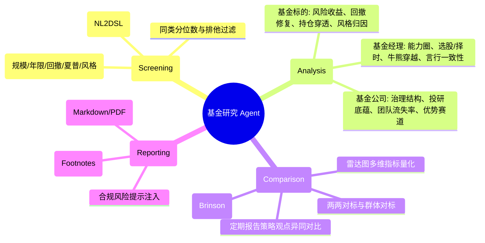
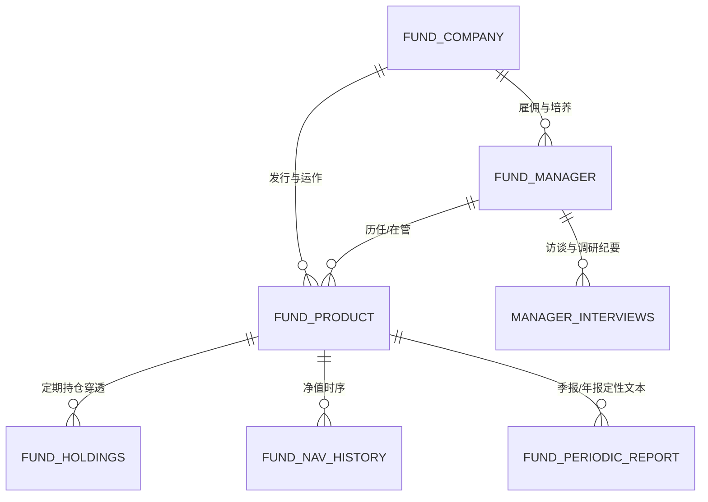
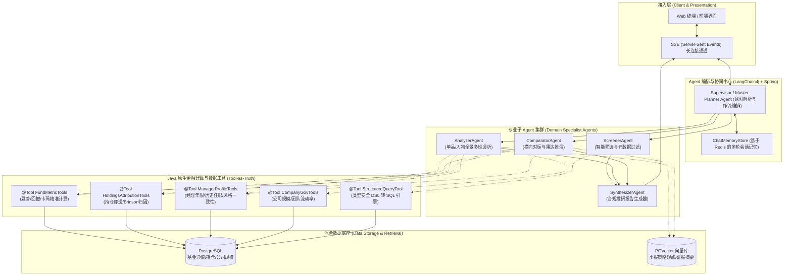
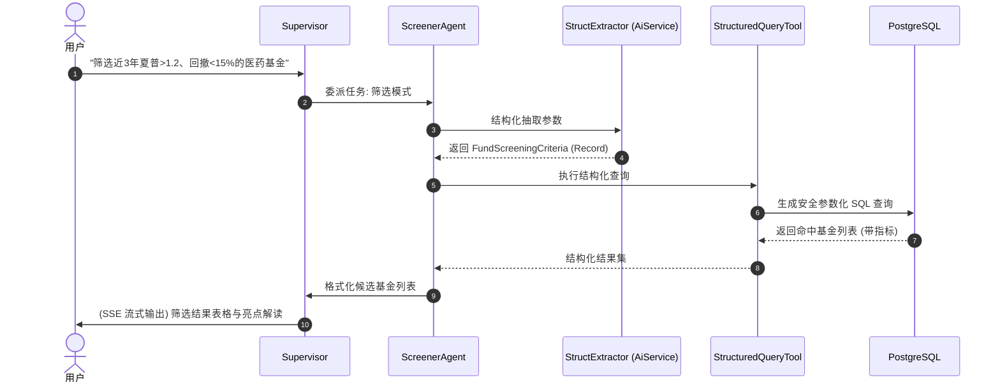
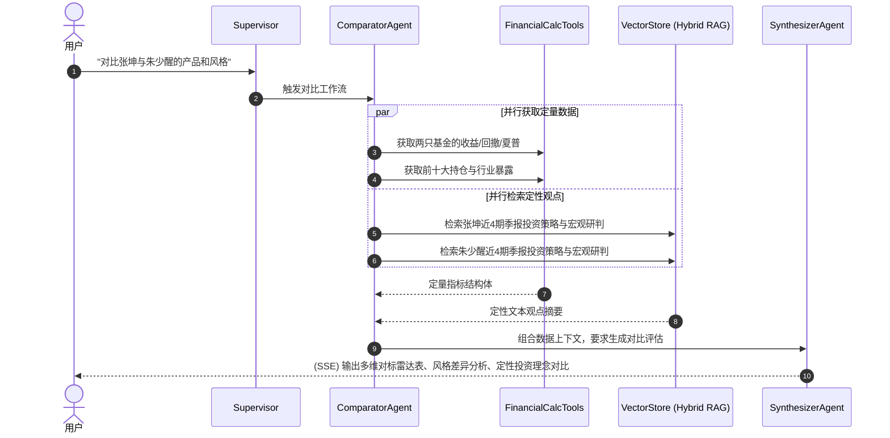

# 金融研究 Agent（基金领域）系统架构与技术方案设计书 (v1.0-Draft)

> **文档状态**：草案讨论稿 (Draft for Discussion)  
> **目标领域**：公募基金全景投研（基金标的、基金经理、基金管理公司）  
> **核心能力**：智能筛选、多维深度分析、横向/纵向对比、专业投研报告生成  
> **技术底座**：Java 21 LTS + Spring Boot 3.3+ + LangChain4j  

---

## 1. 项目愿景与业务边界

### 1.1 核心愿景
打造一个**面向专业投研与财富管理场景的原生 Java AI Agent**。通过“数据与计算分离、模型负责推理与综合（Tool-as-Truth）”的原则，解决传统金融大模型“算不准指标、风格易漂移、缺乏行业合规约束”的痛点，提供高精准度、可解释、可溯源的基金研究辅助。

### 1.2 业务能力矩阵



---

## 2. 领域概念建模与指标体系

金融投研的核心在于“三位一体”拓扑实体关联，模型不能脱离实体关系做推理。

### 2.1 实体拓扑模型



### 2.2 详细指标量化体系 (Java 计算引擎支持)

| 分析实体 | 维度分类 | 核心指标与计算模型 | 业务含义与用途 |
| :--- | :--- | :--- | :--- |
| **基金标的** | **收益特征** | 区间累计收益、年化收益率、Alpha（对标基准）、胜率 | 衡量绝对与相对赚钱能力 |
| | **风险与回撤** | 最大回撤（MaxDrawdown）、年化波动率、下行标准差、最长回撤修复天数 | 衡量持有体验与下行风险控制 |
| | **风险调整收益** | 夏普比率（Sharpe）、卡玛比率（Calmar）、索提诺比率（Sortino）、信息比率（IR） | 衡量单位风险所获得的超额回报 |
| | **持仓与风格** | 前十大重仓占比（持仓集中度）、行业配置集中度、换手率估算、大盘/小盘/价值/成长因子暴露 | 穿透底层底层资产，防风格漂移 |
| **基金经理** | **从业经历** | 证券从业年限、投资管理年限、几何年化回报、几何年化Alpha | 评估投资资历与跨周期经验 |
| | **能力归因** | 选股收益贡献 vs 行业配置收益贡献（Brinson 归因模型） | 识别经理的核心 Alpha 来源是选股还是择时 |
| | **管理负载** | 在管总规模、在管产品数量、跨产品持仓重合度 | 判断是否存在规模过载、一拖多跑冒滴漏 |
| | **言行一致性**| 季报展望行业配置与下期实际持仓匹配度 | 评估经理投资逻辑的严谨性与知行合一 |
| **基金公司** | **平台规模** | 非货管理总规模、权益类规模占比、近3年规模增速 | 评估综合实力与权益投研重视度 |
| | **团队稳定性** | 近3年基金经理离任率、高管变动频次、平均经理任期 | 评估投研团队文化与制度稳定性 |
| | **长期胜率** | 旗下权益基金跑赢基准占比、旗下产品中长期同类前1/2占比 | 评估投研平台的整体赋能效应 |

---

## 3. 技术选型与分层架构

坚持 **Java 原生 AI 生态**，摒弃跨语言 IPC 通信的高昂维护成本，构建高内聚、强类型的企业级体系。

### 3.1 技术选型矩阵

*   **开发语言与运行时**：Java 21 LTS（全面启用 Virtual Threads 处理多 Agent 并发与 I/O 密集型检索）
*   **企业级底座**：Spring Boot 3.3.x + Spring WebFlux（响应式流式输出）
*   **AI 编排框架**：**LangChain4j 0.35+**（在 Java 生态中，对 `@Tool`、`AiServices` 强类型接口、RAG 管道的支持最完善成熟）
*   **存储分层方案**：
    *   **关系型时序库**：PostgreSQL 16（存储基金日行情、净值、持仓穿透、指标汇总）
    *   **向量数据库**：PGVector 插件（与 Postgres 一体化，初期大幅降低运维复杂度）或 Milvus
    *   **缓存与会话**：Redis 7（多轮对话 Agent 记忆上下文、热点筛选结果缓存）
*   **模型对接层**：**多厂商统一大模型适配架构 (Multi-Provider LLM Engine)**，预置支持 DeepSeek、OpenAI、阿里通义千问 (Qwen)、智谱清言 (GLM)、本地 Ollama 及自定义端点。严格实施客户端标准对话 vs 深度思考推理模型路由（Dual-Model Routing: standard vs reasoning）与研发测试后台动态热切换。

### 3.2 系统架构拓扑图



---

## 4. 核心 Agent 工作流与执行模式设计

### 4.1 核心执行原则：Tool-as-Truth（以工具为真理）
大模型极易在多位数乘除、百分比对比、年化复合计算中产生幻觉。系统强制遵循：
1. **禁止模型计算数值**：所有夏普比率、最大回撤、区间年化收益，必须由底层 Java 计算库算出。
2. **提示词防御注入**：System Prompt 中显式约束——“*若涉及收益率、回撤、规模等数字，必须通过已提供的工具返回结果进行陈述，严禁凭经验自造*”。
3. **结构化参数输出**：自然语言筛选只提取过滤条件对象（Java Record），由后端拼接安全 SQL。

### 4.2 典型场景流程时序

#### 场景 A：智能筛选（例：“帮我找近3年夏普大于1.2，最大回撤在15%以内，由5年以上经理管理的医药基金”）



#### 场景 B：双标的横向对比（例：“对比易方达蓝筹精选与富国天惠，两位经理风格有什么差异？”）



---

## 5. Java 原生工程代码架构设计

### 5.1 Maven 模块化结构

```text
financial-copilot/
├── pom.xml                                  // 父工程依赖定义 (Java 21, Spring Boot 3.3.x, LangChain4j 0.35.x)
├── copilot-common/                          // 基础模型、通用枚举、Result 包装类
├── copilot-domain/                          // 领域实体 (Fund, Manager, Company, Holdings)
├── copilot-math-core/                       // 纯 Java 实现的金融指标计算引擎
├── copilot-data-engine/                     // 数据访问层 (MyBatis-Flex/Spring Data JPA, PGVector)
├── copilot-agent-tools/                     // LangChain4j @Tool 工具库实现
├── copilot-agent-core/                      // Agent 定义、Prompt 模板、Supervisor 编排
└── copilot-app/                             // 应用启动类、Web 控制器 (SSE / REST API)
```

### 5.2 核心代码接口设计示例

#### 1. 结构化筛选 DSL 定义 (`FundScreeningCriteria.java`)
```java
package com.financial.copilot.common.dto;

import dev.langchain4j.model.output.structured.Description;

public record FundScreeningCriteria(
    @Description("资产门类，例如：股票型, 偏股混合型, 债券型, 指数型；为空表示不限")
    String fundType,

    @Description("主题或重点行业板块，例如：医药, 半导体, 消费, 新能源, 红利")
    String themeOrSector,

    @Description("最低基金资产净值规模（亿元），例如：5.0")
    Double minScaleInBillion,

    @Description("近三年最大回撤上限（绝对百分比），例如：15.0 表示最大回撤不超过 15%")
    Double maxDrawdown3YLimit,

    @Description("近三年最低夏普比率（例如：1.2）")
    Double minSharpe3Y,

    @Description("基金经理最低投资从业年限（年）")
    Integer minManagerTenureYears,

    @Description("结果排序基准: SHARPE_3Y, RETURN_3Y, MAX_DRAWDOWN_3Y")
    String sortBy,

    @Description("期望返回的匹配数量，默认 10")
    Integer limit
) {}
```

#### 2. LangChain4j 工具集定义 (`FundAnalysisTools.java`)
```java
package com.financial.copilot.agent.tools;

import com.financial.copilot.common.dto.FundMetricsDTO;
import com.financial.copilot.common.dto.ManagerProfileDTO;
import com.financial.copilot.math.FundMetricCalculator;
import dev.langchain4j.agent.tool.P;
import dev.langchain4j.agent.tool.Tool;
import org.springframework.stereotype.Component;

import java.time.LocalDate;

@Component
public class FundAnalysisTools {

    private final FundMetricCalculator calculator;

    public FundAnalysisTools(FundMetricCalculator calculator) {
        this.calculator = calculator;
    }

    @Tool("获取单只基金的历史量化分析指标（包含区间年化回报、最大回撤、夏普比率、卡玛比率、月度胜率）")
    public FundMetricsDTO getFundQuantMetrics(
            @P("基金6位代码，例如 '000001' 或 '110011'") String fundCode,
            @P("统计起始时间，格式 YYYY-MM-DD") String startDate,
            @P("统计截止时间，格式 YYYY-MM-DD") String endDate) {
        return calculator.computeMetrics(fundCode, LocalDate.parse(startDate), LocalDate.parse(endDate));
    }

    @Tool("获取基金经理跨产品投资管理综合画像（在管总规模、任职年限、跨周期代表作、风格稳定性）")
    public ManagerProfileDTO getManagerProfile(
            @P("基金经理姓名或唯一编号") String managerIdentifier) {
        return calculator.computeManagerProfile(managerIdentifier);
    }
}
```

#### 3. 声明式 Agent 接口定义 (`AiServices`)
```java
package com.financial.copilot.agent;

import com.financial.copilot.common.dto.FundScreeningCriteria;
import dev.langchain4j.service.SystemMessage;
import dev.langchain4j.service.UserMessage;
import dev.langchain4j.service.V;

public interface FundAiAgents {

    interface IntentClassifier {
        @SystemMessage("""
            你是一个金融投研意图分类器。请将用户的输入精准划分为以下模式之一：
            - SCREENING (筛选基金)
            - SINGLE_ANALYSIS (单基金/经理/公司多维深度分析)
            - COMPARISON (两两或多方对比)
            - GENERAL_QA (通用金融名词/理念问答)
            仅输出模式枚举值，不要附加多余文字。
            """)
        String classify(@UserMessage String userPrompt);
    }

    interface ScreenerParser {
        @SystemMessage("""
            你是一个专业公募基金量化研究员。请从用户的投资需求自然语言中，解析并填充结构化筛选条件。
            未明确提到的约束条件必须设为 null。
            """)
        FundScreeningCriteria parseToCriteria(@UserMessage String userPrompt);
    }

    interface ComparisonSynthesizer {
        @SystemMessage("""
            你是一位资深 FOF 基金投资总监。请依据下文中真实提供的两方基金、经理、持仓以及季报策略数据，
            生成结构严谨、客观中立的深度对比报告。
            要求包含：
            1. 风险-收益特征对标（防守 vs 进攻能力）；
            2. 持仓风格与选股逻辑剖析（大盘/小盘、集中/分散、高/低换手）；
            3. 经理投资理念与言行一致性解读；
            4. 投资建议与适格投资者画像。
            必须严格引用提供的数据，不得臆造数据指标。
            """)
        String synthesizeComparisonReport(@UserMessage @V("context") String factualContext);
    }
}
```

---

## 6. 关键待讨论与决策问题 (Open Discussion Points)

为确保系统切合实际落地场景，以下核心问题需共同讨论确认：

> [!IMPORTANT]
> ### 讨论点 1：底层金融数据源的获取方案
> - **方案 A（自建清洗/开源数据源）**：基于 AkShare / Tushare 等开源接口，编写定时任务将公募净值、持仓、基本信息同步至本地 PostgreSQL。优点：低成本、自主可控；缺点：历史数据清洗与时效性需要维护。
> - **方案 B（商业数据提供商）**：直接对接 Wind / Choice / 聚源 等机构级 API。优点：字段极其全面、免去清洗工作；缺点：有采购成本与并发配额限制。
> - **当前建议**：初期 MVP 阶段以方案 A（AkShare/Tushare 定时同步到 PostgreSQL）为主，快速验证 Agent 逻辑闭环。

> [!TIP]
> ### 讨论点 2：模型推理部署方式（云端 API vs 私有化部署）
> - **云端 API（DeepSeek / Qwen / Claude）**：开箱即用，推理能力强，适合验证 Agentic 流程。
> - **私有化本地部署（Ollama / vLLM）**：适合金融行业数据隐私强合规场景，需本地配备 GPU 算力卡。

> [!NOTE]
> ### 讨论点 3：存储方案选型（All-in-PostgreSQL vs 多组件拆分）
> - **建议**：初期采用 **PostgreSQL 16 + PGVector 插件**。同一个数据库实例既能支持结构化表格查询，又能支持向量相似度检索，避免维护多套存储（如 MySQL + Milvus）带来的事务和运维复杂度。

---

## 7. 分阶段实施里程碑规划

*   **阶段一：基础设施与 MVP 智能筛选 (Week 1 - 2)**
    *   [ ] 搭建 Maven 多模块工程与 LangChain4j 依赖环境
    *   [ ] 设计 PostgreSQL 数据库 Schema（基金信息、经理档案、日度净值、季度持仓）
    *   [ ] 实现数据抽取与金融基础指标计算库（收益率、最大回撤、夏普）
    *   [ ] 实现 `ScreenerAgent`（NL 转 Criteria DSL，执行安全 SQL 检索并输出结果）
*   **阶段二：多维透视分析与 Hybrid RAG (Week 3 - 4)**
    *   [ ] 搭建定期报告文本切片与向量入库流水线（PGVector）
    *   [ ] 实现持仓穿透与风格归因算法（前十大集中度、行业分布、风格箱）
    *   [ ] 实现 `AnalyzerAgent`（单品/人物画像深度透视与报告生成）
*   **阶段三：横向对比引擎与 SSE 流式交互 (Week 5 - 6)**
    *   [ ] 实现 `ComparatorAgent`（双标的定量数据对齐 + 定性观点对标）
    *   [ ] 实现 Spring WebFlux SSE 流式推送（展示 Agent 思考链过程与打字机输出）
    *   [ ] 前端界面对接与全链路评测调优

---

## 8. 商业化运营与 Token 计量计费中心 (Commercialization & FinOps)

系统引入类似于 DeepSeek / OpenAI 的按量计费与预充值钱包机制，形成完整的 AI 原生商业化闭环：
*   **统一虚拟算力货币（智算点）**：基准汇率 `1 元 = 10,000 智算点`，实现直观计费；
*   **多模型阶梯定价矩阵**：支持针对各厂商不同模型（如快速型 V3 vs 深度推理型 R1/o1）配置独立的 Input、Output 及 Prompt 缓存单价；
*   **企业级账户与钱包中心**：包含用户/租户钱包 (`sys_user_wallet`)、模型定价规则 (`llm_model_pricing`)、不可篡改流水明细 (`llm_token_usage_ledger`)、充值套餐 (`sys_recharge_package`) 与充值订单 (`sys_recharge_order`)；
*   **前置额度保护与并发流控**：前置拦截欠费请求，并在投研报告末尾实时透出 Token 消耗审计与算力点扣减明细。

---
*本设计文档已保存在工程工作区，后续将根据讨论反馈持续演进。*
