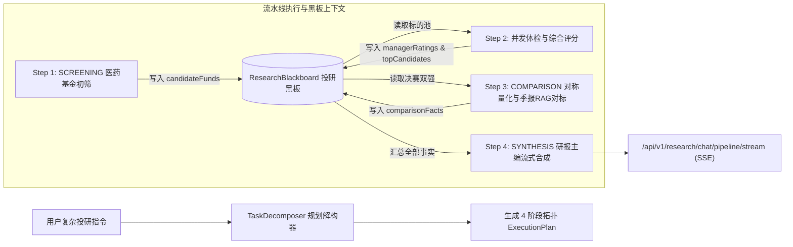

# FinancialCopilot (金融投研多资产多智能体系统)

> **基于 AgentScope Java 2.x + Spring Boot 3.3.x + Lombok + MyBatis-Plus + PostgreSQL 16 (PGVector) 的专业金融多资产智能投研协同平台**

[](https://www.oracle.com/java/)
[](https://spring.io/projects/spring-boot)
[](https://baomidou.com/)
[](LICENSE)

---

## 📌 项目定位与核心优势

`FinancialCopilot` 旨在构建一个具备金融从业者级别严谨度的多资产投研协同底座：
- **首期深度实施公募基金（Fund）领域**（涵盖基金标的、基金经理、基金管理公司三层拓扑网络）；
- **具备通用多资产可扩展架构**：预留股票（Stock）、期货（Futures）、银行理财（Wealth Management）扩展插槽；
- **解决长链路复杂投研问题**：攻克单意图 Router 无法处理复合依赖链的痛点（如：*“筛选过去三年稳定的医药基金 $\to$ 分析前 5 名基金经理 $\to$ 对标最优 2 强 $\to$ 生成最终资产配置建议”*）；
- **Tool-as-Truth 严防幻觉**：年化收益率、最大回撤、夏普比率、卡玛比率等数字一律由原生纯 Java 数学库高精度计算，严禁大模型心算；
- **定性研报混合 RAG**：通过 PostgreSQL PGVector 对基金经理定期报告进行高维切片检索，挖掘知行合一性与投资哲学。

---

## 🏗️ 系统架构设计

### 1. 多资产分层与领域隔离体系

```text
financial-copilot/
├── copilot-common/       // 多资产通用规范 (AssetCategory, AssetProfile) 与流式协议 (ResearchStreamEvent)
├── copilot-domain/       // 领域模型与 SPI 端口 (AssetDomainStrategy, FundDataPort)
├── copilot-math-core/    // 原生纯 Java 高精度金融计算引擎 (TDD 完备单测，夏普/回撤/卡玛)
├── copilot-data-engine/  // 持久层：Lombok + MyBatis-Plus 3.5.7 + PGVector 向量检索 (<=> 操作符)
├── copilot-agent-tools/  // AgentScope 工具箱 (FundQuantAnalysisTool, FundHoldingsQueryTool, ...)
├── copilot-agent-core/   // 核心多 Agent 编排 (TaskDecomposer, ResearchBlackboard, FinancialResearchWorkflow)
├── copilot-app/          // Spring Boot 启动入口、REST 控制器与阶段式 SSE 流式端点
└── docker/postgres/      // PostgreSQL 16 + PGVector 数据库 Docker 编排配置
```

### 2. 复合投研流水线架构 (Composite Pipeline)



---

## 🛠️ 技术栈与规范

| 组件 | 选用技术 | 说明 |
| :--- | :--- | :--- |
| **编程语言** | Java 17 LTS / Java 21 LTS | 核心库使用标准 Java，支持并发 Fan-Out / Fan-In 评估 |
| **基础框架** | Spring Boot 3.3.3 + WebFlux | 响应式流式打字机交互，原生 SSE 协议支持 |
| **多智能体框架** | AgentScope Java 2.0.0 | Supervisor-Specialist 多专家协同拓扑与工具调用 |
| **代码简化** | Lombok 1.18.34 | 全面消除 Getter/Setter/Builder 模板代码 |
| **数据持久层** | MyBatis-Plus 3.5.7 | 零 XML 单表 CRUD，LambdaQueryWrapper 强类型安全 |
| **关系 + 向量存储** | PostgreSQL 16 + PGVector | 一体化存储金融时序、持仓穿透与 1536 维研报向量切片 |
| **推理模型底座** | DeepSeek API | DeepSeek-V3 / DeepSeek-R1 (OpenAI 协议兼容易用) |
| **离线数据同步** | Python 3.10+ & AkShare | 自动化同步真实公募基金净值、持仓与季报文本 |

---

## 🚀 快速启动指南

### 1. 启动数据库底座 (PostgreSQL + PGVector)
进入 `docker/postgres/` 目录启动 Docker 服务：
```bash
docker-compose up -d
```
服务将在本地 `localhost:5432` 启动，默认自动启用 `vector` 插件并加载初始化 DDL 结构。

### 2. 离线样本数据抽取 (可选)
进入 `scripts/data_sync/` 目录：
```bash
pip install -r requirements.txt
python sync_sample_funds.py
```

### 3. 构建与运行测试
在项目根目录下执行全量自动化单元测试：
```bash
mvn clean test
```
全部 8 个子模块将执行编译与单元测试，覆盖复合任务解构、长链路流水线执行、金融数学精度验证及控制器。

### 4. 启动后端应用
在项目根目录启动 Spring Boot 主应用：
```bash
mvn spring-boot:run -pl copilot-app
```
或者运行 `copilot-app` 模块下的 `com.financial.copilot.FinancialCopilotApplication`。

---

## 📡 API 端点概览

### 1. 阶段式复合投研 SSE 流式接口 (推荐)
- **URL**: `GET /api/v1/research/chat/pipeline/stream?prompt={prompt}`
- **响应格式**: `text/event-stream`
- **事件类型**:
  - `PLAN`: 推送整体解构任务总步数与概要说明
  - `STEP_START`: 当前阶段开始执行
  - `STEP_COMPLETE`: 当前阶段完成并输出阶段摘要
  - `CONTENT`: 最终投研研报打字机流式增量文本切片
  - `DONE`: 流水线执行完毕

### 2. 纯打字机流式接口 (简易前端适配)
- **URL**: `GET /api/v1/research/chat/stream?prompt={prompt}`
- **响应格式**: `text/event-stream` (直接推送 Markdown 内容流)

### 3. 同步投研研报生成接口
- **URL**: `POST /api/v1/research/chat`
- **请求体**: `{"prompt": "帮我分析张坤的投资能力"}`
- **响应**: `ApiResult<String>` 包含完整结构化 Markdown 报告

### 4. 平台健康检查与多资产能力清单
- **URL**: `GET /api/v1/research/health`
- **响应示例**:
```json
{
  "code": 200,
  "message": "success",
  "data": {
    "status": "UP",
    "system": "Financial Research Agent (AgentScope + Spring Boot 3 + MyBatis-Plus)",
    "activeDomain": "FUND (公募基金深度实施)",
    "extensibleDomains": ["STOCK (股票)", "FUTURES (期货)", "WEALTH (银行理财)"],
    "pipelineCapabilities": ["SCREENING", "BATCH_ANALYSIS", "COMPARISON", "SYNTHESIS", "COMPOSITE_DAG"],
    "orm": "Lombok + MyBatis-Plus 3.5.7 + PGVector"
  }
}
```

---

## 📄 许可证

本项目采用 [Apache License 2.0](LICENSE) 协议开源。
