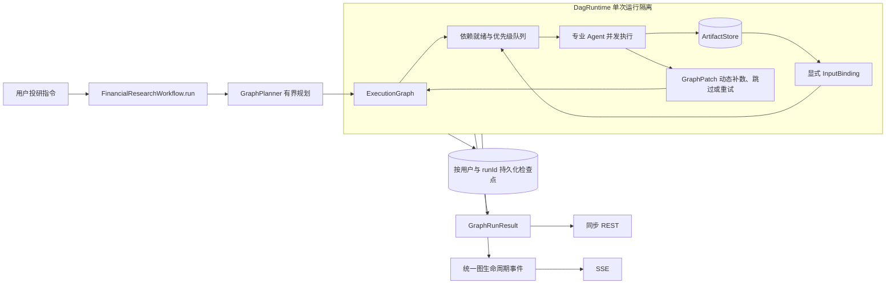

# FinancialCopilot (金融投研多智能体系统)

> **基于 AgentScope Java 2.x + Spring Boot 3.3.x + Lombok + MyBatis-Plus + PostgreSQL 16 (PGVector) 的专业金融智能投研协同平台**

[](https://www.oracle.com/java/)
[](https://spring.io/projects/spring-boot)
[](https://baomidou.com/)
[](LICENSE)

---

## 📌 项目定位与核心优势

`FinancialCopilot` 旨在构建一个具备金融从业者级别严谨度的投研协同底座：
- **首期深度实施公募基金（Fund）领域**（涵盖基金标的、基金经理、基金管理公司三层拓扑网络）；
- **具备通用可扩展架构**：预留股票（Stock）、期货（Futures）、银行理财（Wealth Management）扩展插槽；
- **解决长链路复杂投研问题**：攻克单意图 Router 无法处理复合依赖链的痛点（如：*“筛选过去三年稳定的医药基金 $\to$ 分析前 5 名基金经理 $\to$ 对标最优 2 强 $\to$ 生成最终资产配置建议”*）；
- **Tool-as-Truth 严防幻觉**：年化收益率、最大回撤、夏普比率、卡玛比率等数字一律由原生纯 Java 数学库高精度计算，严禁大模型心算；
- **定性研报混合 RAG**：通过 PostgreSQL PGVector 对基金经理定期报告进行高维切片检索，挖掘知行合一性与投资哲学。

---

## 🏗️ 系统架构设计

### 1. 分层与领域隔离体系

```text
financial-copilot/
├── copilot-common/       // 通用规范 (AssetCategory, AssetProfile) 与流式协议 (ResearchStreamEvent)
├── copilot-domain/       // 领域模型与 SPI 端口 (AssetDomainStrategy, FundDataPort)
├── copilot-math-core/    // 原生纯 Java 高精度金融计算引擎 (TDD 完备单测，夏普/回撤/卡玛)
├── copilot-data-engine/  // 持久层：Lombok + MyBatis-Plus 3.5.7 + PGVector 向量检索 (<=> 操作符)
├── copilot-agent-tools/  // AgentScope 工具箱 (FundQuantAnalysisTool, FundHoldingsQueryTool, ...)
├── copilot-agent-core/   // 动态图规划与执行 (GraphPlanner, DagRuntime, FinancialResearchWorkflow)
├── copilot-app/          // Spring Boot 启动入口、REST 控制器与图事件 SSE 端点
└── docker/postgres/      // PostgreSQL 16 + PGVector 数据库 Docker 编排配置
```

### 2. 统一动态执行图架构



同步、结构化和 SSE 接口都构造 `GraphRunRequest`，只通过 `FinancialResearchWorkflow.run(...)` 进入执行系统。每次运行拥有独立的图、就绪队列、产物、状态、取消令牌和事件流；检查点支持按登录用户查询、取消和恢复。

---

## 🛠️ 技术栈与规范

| 组件 | 选用技术 | 说明 |
| :--- | :--- | :--- |
| **编程语言** | Java 21 LTS | 使用虚拟线程执行并发 Fan-Out / Fan-In 评估 |
| **基础框架** | Spring Boot 3.3.3 + WebFlux | 响应式流式打字机交互，原生 SSE 协议支持 |
| **多智能体框架** | AgentScope Java 2.0.0 | Supervisor-Specialist 多专家协同拓扑与工具调用 |
| **代码简化** | Lombok 1.18.34 | 全面消除 Getter/Setter/Builder 模板代码 |
| **数据持久层** | MyBatis-Plus 3.5.7 | 零 XML 单表 CRUD，LambdaQueryWrapper 强类型安全 |
| **关系 + 向量存储** | PostgreSQL 16 + PGVector | 一体化存储金融时序、持仓穿透与 1536 维研报向量切片 |
| **推理模型底座** | DeepSeek API | DeepSeek-V3 / DeepSeek-R1 (OpenAI 协议兼容易用) |
| **离线数据同步** | Python 3.10+ & AkShare | 自动化同步真实公募基金净值、持仓与季报文本 |

---

## 🚀 快速启动指南

### 1. 启动数据库底座 (PostgreSQL + PGVector)
进入 `docker/postgres/` 目录启动 Docker 服务：
```bash
docker-compose up -d
```
服务将在本地 `localhost:5432` 启动，默认自动启用 `vector` 插件并加载初始化 DDL 结构。

### 2. 离线样本数据抽取 (可选)
进入 `scripts/data_sync/` 目录：
```bash
pip install -r requirements.txt
python sync_sample_funds.py
```

### 3. 构建与运行测试
在项目根目录下执行全量自动化单元测试：
```bash
mvn -s maven-settings.xml clean test
```
父工程及 7 个子模块将执行编译与单元测试，覆盖动态图规划、依赖调度、并发隔离、检查点恢复、金融数学精度及控制器。项目提供 HTTPS Maven 镜像配置，避免继承机器上的旧 HTTP 镜像；依赖齐备后可以加 `-o` 离线运行。

完整启动与记忆存储验证需要 PostgreSQL 和 Redis，显式执行：

```bash
mvn -s maven-settings.xml test "-Dcopilot.integration=true"
```

该测试启动随机端口上的完整 Spring Boot 应用，检查健康接口、短期记忆裁剪，以及长期记忆和提纯事实的真实数据库读写；不调用远程模型。测试使用随机会话 ID，结束后只清理该会话的数据。未指定此开关时，外部服务集成测试会跳过。

数据库连接使用 `DB_HOST`、`DB_PORT`、`DB_NAME`、`DB_USER`、`DB_PASSWORD` 环境变量（默认值见 `application.yml`）。Redis 使用 `REDIS_HOST`、`REDIS_PORT`、`REDIS_PASSWORD`、`REDIS_DATABASE`，默认连接本机 `localhost:6379`、数据库 0；启用了认证的实例需设置 `REDIS_PASSWORD`。应用启动时执行 `db/memory-schema.sql`，幂等创建两张记忆表及索引，已有业务数据保持不变；数据库账号需要建表权限。基础业务表仍由 Docker 的 `initdb/01_init_schema.sql` 初始化。

### 4. 启动后端应用
在项目根目录启动 Spring Boot 主应用：
```bash
mvn spring-boot:run -pl copilot-app
```
或者运行 `copilot-app` 模块下的 `com.financial.copilot.FinancialCopilotApplication`。

---

## 📡 API 端点概览

### 1. 统一投研运行入口

- **URL**: `POST /api/v1/research/runs`
- **请求体**: `{"prompt": "帮我分析张坤的投资能力", "sessionId": "可选", "enableThinking": false}`
- **同步响应**: 请求头 `Accept: application/json`，返回包含 `runId`、报告、Graph 版本、节点数和 token 统计的结构化结果
- **流式响应**: 请求头 `Accept: text/event-stream`，返回动态执行图事件流
- **事件类型**:
  - `graph_initialized`: 返回初始图、真实版本号和节点依赖
  - `node_ready` / `node_started` / `node_completed`: 节点生命周期
  - `graph_updated`: 动态图补丁及新版本号
  - `content_chunk`: 最终研报增量文本
  - `node_failed` / `run_failed` / `run_cancelled`: 失败和取消状态
  - `run_completed`: 本次运行完成及耗时

### 2. 运行控制接口

- `GET /api/v1/research/runs/{runId}`：查询当前用户拥有的检查点和节点状态
- `POST /api/v1/research/runs/{runId}/cancel`：取消当前用户正在执行的运行
- `POST /api/v1/research/runs/{runId}/resume`：从当前用户的持久化检查点恢复

### 3. 平台健康检查与能力清单
- **URL**: `GET /api/v1/research/health`
- **响应示例**:
```json
{
  "code": 200,
  "message": "success",
  "data": {
    "status": "UP",
    "system": "Financial Research Agent (AgentScope + Spring Boot 3 + MyBatis-Plus)",
    "activeDomain": "FUND (公募基金深度实施)",
    "extensibleDomains": ["STOCK (股票)", "FUTURES (期货)", "WEALTH (银行理财)"],
    "pipelineCapabilities": ["SCREENING", "BATCH_ANALYSIS", "COMPARISON", "SYNTHESIS", "COMPOSITE_DAG"],
    "orm": "Lombok + MyBatis-Plus 3.5.7 + PGVector"
  }
}
```

---

## 🧠 提示词、上下文工程与 Agent Skills 体系

系统遵循最新的 Context Engineering 与工业级 Prompt 架构规范：

### 1. RTCF 提示词模型与 Context Caching 友好架构
- **Role (角色人设)**: 作为静态高优先级 System Prompt，前缀稳定以最大化命中厂商的 **Context Caching** 缓存减费策略；
- **Task (当前任务)**: 明确当前阶段唯一的清晰目标；
- **Context (事实槽)**: 分槽装配清洗后的观察值、用户画像约束、历史记忆与命中 Skill；
- **Format (格式规范)**: 约定严谨的输出协议（JSON Schema 或结构化 Markdown 分级研报）。

### 2. 上下文治理与观察值净化 (Observation Hygiene)
- **ObservationSanitizer**: 深度清洗工具返回的原始 JSON，去除大量 `null` 与嵌套冗余，转化为高信噪比事实，**降低 Token 消耗 50%~70%**，杜绝大模型在复杂嵌套括号中的注意力漂移；
- **StructuredUserPromptBuilder**: 提供标准化分槽隔离，彻底防止业务字段、用户提问与工具结果互相混淆污染；
- **ContextReducer & ContextBudgetManager**: 短期记忆超限时自动将早期历史对话提炼为滚动摘要 (Rolling Summary) 置顶保留，结合配额管理器进行自适应安全截断。

### 3. Agent Skills 机制 (按需发现与动态加载)
- **SKILL.md 规范**: 存放在 `classpath:skills/{skill_name}/SKILL.md`，使用 YAML 元数据标注任务类型、触发词与行业细化准则；
- **按需加载**: `SkillMatcher` 仅在子任务类型或用户意图命中时动态装配对应规则，**未命中技能零 Token 占用**；
- **内置首发技能**:
  - `fund-comparison`: 基金两强横向对标四步审计法（风险收益对称性、重仓风格漂移检验、言行一致性核验、市场风格适应性）；
  - `asset-allocation`: 适格投资者 C1~C5 风险等级与核心-卫星仓位管理规范；
  - `quant-screening`: 公募基金量化初筛硬性准入门槛与异常风控剔除准则。

---

## 📄 许可证

本项目采用 [Apache License 2.0](LICENSE) 协议开源。


## 用户隔离、计费与支付宝接入

投研、钱包、订单和会话记忆接口使用登录 JWT 中的用户 ID。兼容的 `userId` 参数只能等于当前用户，否则返回 403；会话按用户隔离，同名会话不会共享记忆。旧的未归属用户会话不会自动迁移。

计费取模型响应的实际 `usage` 和模型名称，覆盖规划、基金对比与报告合成。Mock 不收费；真实调用缺失 usage、缺少有效模型定价或数据库不可用时会报错。扣款与用量流水在同一数据库事务内，余额不足不会写成功流水。后台记忆提纯属于系统成本。流式报告开始后，客户端断连仍会完成该次模型调用并按最终用量结算，不再开始后续步骤。

### 支付宝配置

使用支付宝官方 Java SDK 的 RSA2 公钥模式和电脑网站支付。默认关闭支付，默认选择沙箱。通过运行环境设置以下变量，不要把密钥提交到仓库：

| 环境变量 | 含义 |
| --- | --- |
| `ALIPAY_ENABLED` | 配置完成后设为 `true` |
| `ALIPAY_SANDBOX` | 沙箱 `true`，生产 `false` |
| `ALIPAY_APP_ID` | 对应环境的应用 ID |
| `ALIPAY_SELLER_ID` | 收款商户的支付宝用户 ID |
| `ALIPAY_PRIVATE_KEY` | 应用 RSA2 私钥 |
| `ALIPAY_PUBLIC_KEY` | 支付宝公钥，用于验证通知，不是应用公钥 |
| `ALIPAY_NOTIFY_URL` | 公网 HTTPS 地址，路径 `/api/v1/billing/alipay/notify` |

1. 登录后调用 `POST /api/v1/billing/order/create`，指定套餐及 `payChannel: "ALIPAY"`。金额和到账积分取服务端套餐快照。
2. 调用 `POST /api/v1/billing/alipay/order/{orderNo}/pay`，携带登录令牌，获得 `data` 中的签名支付跳转 URL；只允许当前订单所有者获取。
3. 支付宝向通知地址发送表单。服务端验签并核对应用、商户、订单及金额，只有成功交易状态到账。订单行锁和数据库事务保证重复通知只到账一次；同一支付宝交易号不能用于两个已支付订单。通知响应为纯文本 `success` 或 `failure`。

旧 `POST /api/v1/billing/order/pay-callback` 已停用。页面跳转不作为到账凭据。当前不包含支付前端；退款、对账和证书模式不在本轮范围内。

启动时额外执行 `db/billing-schema.sql` 创建已支付交易号唯一索引。历史重复交易数据会阻止索引创建，需要先核查历史订单。集成测试开关 `-Dcopilot.integration=true` 同时覆盖真实 PostgreSQL 的并发重复通知与扣款/流水事务回滚，使用随机测试记录并清理。

本地签名测试使用临时生成的 RSA 密钥验证协议和篡改拒绝；正式启用前仍需使用商户沙箱凭据验证完整跳转、付款及公网异步通知。参考 [官方 SDK 文档](https://github.com/alipay/alipay-sdk-java-all/blob/master/v2/README.md) 和 [官方异步通知校验说明](https://developer.alibaba.com/docs/doc.htm?articleId=105301&docType=1&treeId=193)。
