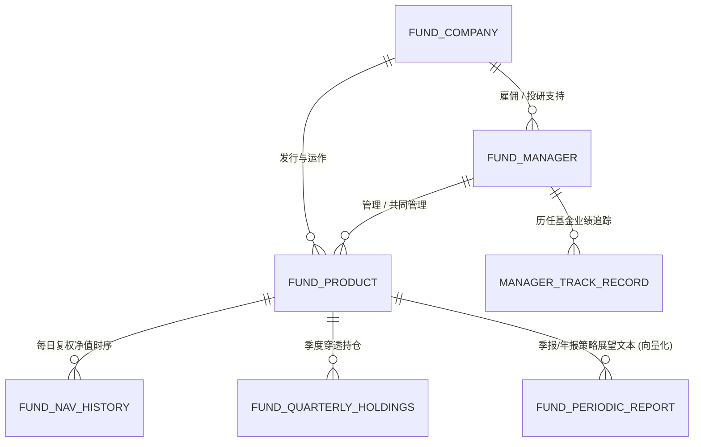
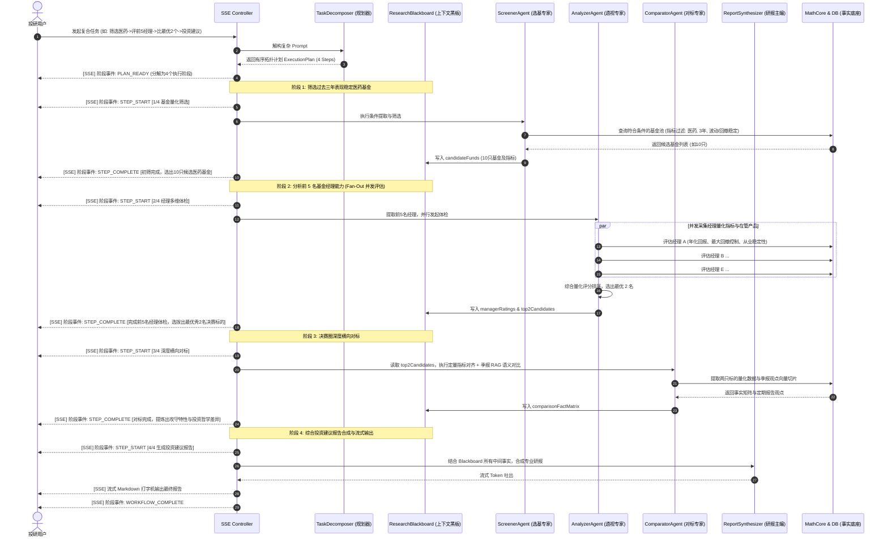

# 金融研究 Agent 架构设计规范书（公募基金深度实施版）

> **设计日期**：2026-09-10  
> **文档定位**：系统设计标准与实施基准规范 (Design Specification)  
> **核心框架**：AgentScope Java 2.x + Spring Boot 3.3.x (Java 21 LTS, 启用虚拟线程)  
> **持久层规范**：Lombok + MyBatis-Plus 3.5.x + PostgreSQL 16 + PGVector  
> **推理模型**：DeepSeek 官方 API (DeepSeek-V3 / DeepSeek-R1)  
> **领域定位**：**通用投研底座**，首期深度实施**公募基金（Fund）领域**，预留**股票（Stock）**、**期货（Futures）**、**银行理财（Wealth Management）**平滑扩展接口。

---

## 1. 业务目标与领域架构设计

### 1.1 可扩展分层体系（Multi-Asset Architecture）

为避免系统过度耦合于单一资产形态，整体架构划分为“**通用投研抽象层（Universal Asset Layer）**”与“**特定资产领域插件层（Asset Domain Plugins）**”：

```mermaid
graph TD
    User([投研分析师 / 机构投资者]) --> MultiAgentWorkflow[多智能体复合流水线 Multi-Agent Workflow]
    
    subgraph UniversalLayer [通用金融投研底座 (Universal Core)]
        AssetCategory[资产大类枚举: FUND / STOCK / FUTURES / WEALTH]
        AssetProfile[统一资产简档 AssetProfile]
        TaskDecomposer[复杂任务解构器 TaskDecomposer]
        ResearchBlackboard[投研黑板上下文 ResearchBlackboard]
        AssetDomainRegistry[资产领域策略注册中心 AssetDomainRegistry]
    end

    subgraph AssetPlugins [特定资产领域实现 (首期深度实现: Fund)]
        FundDomain[公募基金领域 (Fund Domain)]
        StockDomain[A股/港美股领域 (Stock Domain - 规划中)]
        FuturesDomain[大宗商品期货领域 (Futures Domain - 规划中)]
        WealthDomain[银行理财/信托领域 (Wealth Domain - 规划中)]
    end

    MultiAgentWorkflow --> UniversalLayer
    AssetDomainRegistry -->|动态分发| FundDomain
    AssetDomainRegistry -.->|未来扩展| StockDomain
    AssetDomainRegistry -.->|未来扩展| FuturesDomain
    AssetDomainRegistry -.->|未来扩展| WealthDomain
```

#### 统一抽象规范：
1. **`AssetCategory` 枚举**：定义资产类别（`FUND` 基金、`STOCK` 股票、`FUTURES` 期货、`WEALTH_MANAGEMENT` 银行理财）。
2. **`AssetProfile` 统一标的契约**：包含跨资产通用的基础字段（`assetCode`, `assetName`, `category`, `exchangeOrIssuer`, `latestPriceOrNav`, `updateDate`）。
3. **`AssetDomainStrategy` 策略接口体系**：
   - `AssetScreeningStrategy<C, R>`：资产智能初筛契约。
   - `AssetAnalysisStrategy<R>`：多维量化与基本面体检契约。
   - `AssetComparatorStrategy<R>`：多标的深度对标契约。
4. **`AssetDomainRegistry`**：根据用户指令由 Agent 识别出目标资产大类后，动态路由到对应的特定资产执行引擎（首期默认且深度注入 `FundDomainStrategy`）。

---

### 1.2 首期深度实施：公募基金领域实体模型

首期系统聚焦于公募基金领域的三个核心主体及其拓扑关联：**基金标的（Fund）、基金经理（Manager）、基金管理公司（Company）**。



#### 业务功能边界：
1. **智能多维筛选（Screener）**：
   - 自然语言转结构化查询条件（NL2DSL）。
   - 支持复合约束：基金分类（股票型/偏股混合/纯债/二级债基/QDII）、行业板块主题（医药、半导体、消费等）、近 1/3/5 年年化收益率、最大回撤阈值、夏普比率、卡玛比率、经理任职年限、在管规模、公司权益评级。
2. **多维立体分析（Analyzer）**：
   - **基金标的**：收益与超额特征、波动与回撤控制、最长回撤修复期、持仓集中度穿透、风格箱特征（大盘/小盘、价值/成长）。
   - **基金经理**：几何年化回报、代表作牛熊穿越表现、投资风格稳定性（风格漂移度检测）、选股与择时能力归因。
   - **基金公司**：非货/权益总管理规模、投研团队实力与流失率、旗下产品中长期同类胜率分布。
3. **深度横向对比（Comparator）**：
   - 两两对标或多标的对标。
   - 量化指标强对齐（雷达图量化数据）。
   - 季报定性观点对标（通过 PGVector 检索两名经理在多期季报中对宏观、资产配置方向的定性展望，对比投资哲学与知行合一性）。
4. **研报工坊与流式输出（Reporting）**：
   - 结构化合规投研报告生成。
   - 数据溯源脚注（Footnotes / Data Citation）。
   - Spring WebFlux SSE 响应式流式打字机输出。

---

## 2. 复杂投研问题解决设计（Composite Multi-Step Pipeline）

### 2.1 问题与挑战

对于简单的单意图场景（如“帮我筛选夏普大于1的医药基金”、“分析张坤的能力”、“对比易方达蓝筹与富国天惠”），单层路由调度完全足够。

然而，真实的专业投研场景往往是**高阶复合链式任务**，例如：
> “**帮我筛选过去三年表现稳定的医药基金，然后分析前 5 名基金经理的能力，再比较其中最优秀的两个，最后生成投资建议。**”

该场景下单意图 Router 必然失效，其具备四个关键特征：
1. **拓扑依赖链**：后一个步骤的输入严格依赖前一个步骤的产出（筛选结果 $\to$ 经理评估候选池 $\to$ Top 2 决赛圈 $\to$ 最终投资建议报告）。
2. **并发扇出/聚合（Fan-out / Fan-in）**：对前 5 名基金经理的量化和履历评估需要并发执行，然后通过打分算法聚合排序。
3. **上下文黑板共享（Blackboard Pattern）**：需要跨越多个 Agent 的共享上下文传递中间数据实体，而不是仅仅依靠大模型的长提示词聊天记录。
4. **过程透明与渐进式流式反馈（Step-by-Step Progress Events）**：长流水线运行可能需要 5~15 秒，系统必须通过 SSE 实时向用户上报各阶段执行状态。

---

### 2.2 复合投研流水线架构图



---

### 2.3 关键组件技术设计

#### 1. `TaskDecomposer`（任务解构器）
通过专门调优的 Few-Shot Prompt 指导 DeepSeek 将用户输入解析为强类型 `ExecutionPlan`：
```json
{
  "isComplex": true,
  "summary": "三年稳定医药基金筛选 -> 前5名经理多维评估 -> Top2横向对标 -> 最终配置建议",
  "steps": [
    {
      "stepIndex": 1,
      "taskType": "SCREENING",
      "description": "筛选过去三年表现稳定的医药主题基金",
      "params": {
        "sector": "医药",
        "minYears": 3,
        "maxDrawdownLimit": 30.0,
        "limit": 10
      },
      "outputKey": "candidateFunds"
    },
    {
      "stepIndex": 2,
      "taskType": "BATCH_ANALYSIS",
      "description": "评估候选基金排名前5的基金经理专业能力并打分",
      "dependsOn": [1],
      "inputKey": "candidateFunds",
      "params": { "topN": 5, "selectBest": 2 },
      "outputKey": "topCandidates"
    },
    {
      "stepIndex": 3,
      "taskType": "COMPARISON",
      "description": "对排名前2的最优标的进行全方位定量与定性季报对标",
      "dependsOn": [2],
      "inputKey": "topCandidates",
      "outputKey": "comparisonFacts"
    },
    {
      "stepIndex": 4,
      "taskType": "SYNTHESIS",
      "description": "汇总前序事实，生成包含配置逻辑与风险提示的最终投资建议",
      "dependsOn": [1, 2, 3],
      "outputKey": "finalReport"
    }
  ]
}
```
*注：对于简单单意图请求，`TaskDecomposer` 仅生成 1 个步骤的 Plan，无缝退化为即时单步处理。*

#### 2. `ResearchBlackboard`（投研黑板）
作为流水线的状态总线与上下文载体：
```java
public class ResearchBlackboard {
    private final Map<String, Object> state = new ConcurrentHashMap<>();

    public void put(String key, Object value) { state.put(key, value); }
    public <T> T get(String key, Class<T> clazz) { return clazz.cast(state.get(key)); }
    public boolean has(String key) { return state.containsKey(key); }
}
```

#### 3. Fan-Out 并发评估 (Java 21 虚拟线程)
在阶段 2 中，针对 Top 5 基金经理的多维度体检，利用 Java 21 `Executors.newVirtualThreadPerTaskExecutor()` 瞬间并发发起指标计算与数据拉取，随后聚合（Fan-In）送入综合评分模型，执行耗时由串行的 5 秒缩减至 500ms 以内。

---

## 3. 技术栈规范：Lombok + MyBatis-Plus + PostgreSQL

系统全面拥抱 **Lombok** 消除 Java 模板冗余，持久层统一采用 **MyBatis-Plus 3.5.x for Spring Boot 3**，杜绝 Spring Data JPA 与原生复杂 XML 映射配置。

### 3.1 实体（PO）定义规范
所有数据库实体统一放置于 `copilot-data-engine` 模块，标注 `@TableName`, `@TableId`, `@TableField` 与 Lombok 注解：

```java
package com.financial.copilot.data.fund.po;

import com.baomidou.mybatisplus.annotation.TableId;
import com.baomidou.mybatisplus.annotation.TableName;
import lombok.AllArgsConstructor;
import lombok.Builder;
import lombok.Data;
import lombok.NoArgsConstructor;
import java.math.BigDecimal;
import java.time.LocalDate;

@Data
@Builder
@NoArgsConstructor
@AllArgsConstructor
@TableName("fund_info")
public class FundInfoPO {
    @TableId
    private String fundCode;
    private String fundName;
    private String fundType;
    private LocalDate establishmentDate;
    private String managementCompanyId;
    private BigDecimal currentScaleBillion;
    private String trackingBenchmark;
}
```

### 3.2 Mapper 规范（MyBatis-Plus `BaseMapper`）
单表 CRUD 与常规字段筛选直接采用 `BaseMapper<T>` 配合 `LambdaQueryWrapper<T>`，简洁、类型安全、重构友好：

```java
package com.financial.copilot.data.fund.mapper;

import com.baomidou.mybatisplus.core.mapper.BaseMapper;
import com.financial.copilot.data.fund.po.FundInfoPO;
import org.apache.ibatis.annotations.Mapper;

@Mapper
public interface FundInfoMapper extends BaseMapper<FundInfoPO> {
    // 基础单表增删改查完全无需任何 XML 配置！
}
```

### 3.3 PGVector 向量检索支持（MyBatis-Plus 注解/XML 实现）
对于季报切片高维文本向量（Embedding 维度 1536），在 MyBatis-Plus 中通过自定义注解查询直接映射 PostgreSQL 的 `<=>`（余弦距离）操作符：

```java
package com.financial.copilot.data.fund.mapper;

import com.baomidou.mybatisplus.core.mapper.BaseMapper;
import com.financial.copilot.data.fund.po.FundReportVectorPO;
import org.apache.ibatis.annotations.Mapper;
import org.apache.ibatis.annotations.Param;
import org.apache.ibatis.annotations.Select;
import java.util.List;

@Mapper
public interface FundReportVectorMapper extends BaseMapper<FundReportVectorPO> {

    @Select("""
        SELECT id, fund_code, report_quarter, section_title, content, created_at,
               (embedding <=> #{queryVector}::vector) AS distance
        FROM fund_report_vector
        WHERE fund_code IN (${fundCodes})
        ORDER BY distance ASC
        LIMIT #{topK}
    """)
    List<FundReportVectorPO> searchSimilarSections(
            @Param("fundCodes") String fundCodesCommaSeparated,
            @Param("queryVector") String queryVectorJson,
            @Param("topK") int topK);
}
```

---

## 4. 系统分层与 Maven 工程模块设计

清晰划分“通用底座”与“基金专属领域模块”的包结构：

```text
financial-copilot/
├── pom.xml                                  // 父 POM：管理 Java 21、Spring Boot 3.3.x、MyBatis-Plus、Lombok
├── copilot-common/                          // 通用资产模型、枚举、统一结果集
│   └── src/main/java/com/financial/copilot/common/
│       ├── enums/AssetCategory.java         // [核心] FUND, STOCK, FUTURES, WEALTH
│       ├── model/AssetProfile.java          // [核心] 统一资产简档
│       ├── result/ApiResult.java            // 全局统一结果封装
│       └── fund/dto/                        // 基金专属 DTO (FundScreeningCriteria, FundMetricsDTO)
├── copilot-domain/                          // 领域模型与核心业务抽象
│   └── src/main/java/com/financial/copilot/domain/
│       ├── core/strategy/AssetDomainStrategy.java // [核心] 通用资产策略接口
│       ├── core/registry/AssetDomainRegistry.java // [核心] 策略路由注册中心
│       └── fund/                            // [首期深度实现] 基金领域模型
│           ├── entity/ (FundInfo, FundManager, FundCompany, FundNavHistory, FundHolding)
│           └── port/FundDataPort.java       // 基金数据访问 SPI
├── copilot-math-core/                       // 纯 Java 原生金融指标计算库 (夏普/回撤/卡玛/胜率/Brinson)
├── copilot-data-engine/                     // 数据访问层：Lombok + MyBatis-Plus + PGVector
│   └── src/main/java/com/financial/copilot/data/
│       └── fund/                            // 基金数据持久化
│           ├── po/ (FundInfoPO, FundManagerPO, FundNavHistoryPO, FundReportVectorPO)
│           ├── mapper/ (FundInfoMapper, FundNavHistoryMapper, FundReportVectorMapper)
│           └── adapter/DatabaseFundDataAdapter.java // 适配 FundDataPort
├── copilot-agent-tools/                     // AgentScope 工具包
│   └── src/main/java/com/financial/copilot/agent/tools/
│       └── fund/                            // 基金专业工具 (Tool-as-Truth)
│           ├── FundScreeningTool.java       // 基金初筛工具
│           ├── FundQuantAnalysisTool.java   // 基金量化体检工具
│           ├── FundHoldingsQueryTool.java   // 基金持仓透视工具
│           └── FundReportRetrieverTool.java // 季报 RAG 语义检索工具
├── copilot-agent-core/                      // AgentScope 多智能体编排与复合流水线
│   └── src/main/java/com/financial/copilot/agent/core/
│       ├── pipeline/                        // [复合任务核心]
│       │   ├── TaskDecomposer.java          // 复杂意图解构与 ExecutionPlan 生成
│       │   ├── ResearchBlackboard.java      // 投研黑板上下文总线
│       │   └── ExecutionPlan.java           // 计划与子任务模型
│       ├── agents/                          // 专家智能体
│       │   ├── ScreenerAgent.java
│       │   ├── AnalyzerAgent.java
│       │   ├── ComparatorAgent.java
│       │   └── ReportSynthesizer.java
│       └── workflow/FinancialResearchWorkflow.java // 流水线编排中枢
└── copilot-app/                             // Web 启动端点、REST API 与 SSE 流式控制器
```

---

## 5. PostgreSQL 16 + PGVector 数据存储模型设计

统一使用一套 PostgreSQL 数据库，兼顾关系型业务表与高维文本向量表。

### 5.1 核心 DDL 架构
```sql
-- 1. 启用 pgvector 插件
CREATE EXTENSION IF NOT EXISTS vector;

-- 2. 基金基础信息表 (fund_info)
CREATE TABLE IF NOT EXISTS fund_info (
    fund_code VARCHAR(10) PRIMARY KEY,
    fund_name VARCHAR(100) NOT NULL,
    fund_type VARCHAR(50) NOT NULL,            -- 股票型 / 偏股混合型 / 债券型 / 指数型
    establishment_date DATE NOT NULL,
    management_company_id VARCHAR(20) NOT NULL,
    current_scale_billion NUMERIC(10, 2),      -- 最新规模 (亿元)
    tracking_benchmark TEXT                    -- 业绩比较基准
);

-- 3. 基金经理档案表 (fund_manager)
CREATE TABLE IF NOT EXISTS fund_manager (
    manager_id VARCHAR(20) PRIMARY KEY,
    manager_name VARCHAR(50) NOT NULL,
    company_id VARCHAR(20) NOT NULL,
    working_days INT NOT NULL,                 -- 从业天数
    current_total_scale_billion NUMERIC(10, 2) -- 在管总规模 (亿元)
);

-- 4. 基金-经理任职映射表 (fund_manager_mapping)
CREATE TABLE IF NOT EXISTS fund_manager_mapping (
    id BIGSERIAL PRIMARY KEY,
    fund_code VARCHAR(10) REFERENCES fund_info(fund_code),
    manager_id VARCHAR(20) REFERENCES fund_manager(manager_id),
    start_date DATE NOT NULL,
    end_date DATE,                             -- NULL 表示现任
    is_current BOOLEAN DEFAULT TRUE
);

-- 5. 基金每日复权净值时序表 (fund_nav_history)
CREATE TABLE IF NOT EXISTS fund_nav_history (
    id BIGSERIAL PRIMARY KEY,
    fund_code VARCHAR(10) NOT NULL,
    nav_date DATE NOT NULL,
    unit_nav NUMERIC(10, 4) NOT NULL,          -- 单位净值
    accumulated_nav NUMERIC(10, 4) NOT NULL,   -- 累计净值
    daily_growth_rate NUMERIC(8, 4),           -- 日涨跌幅 (%)
    CONSTRAINT uk_fund_nav_date UNIQUE(fund_code, nav_date)
);

-- 6. 季度前十大持仓明细表 (fund_quarterly_holdings)
CREATE TABLE IF NOT EXISTS fund_quarterly_holdings (
    id BIGSERIAL PRIMARY KEY,
    fund_code VARCHAR(10) NOT NULL,
    report_quarter VARCHAR(10) NOT NULL,       -- 如: '2024Q2'
    stock_code VARCHAR(20) NOT NULL,
    stock_name VARCHAR(100) NOT NULL,
    holding_ratio NUMERIC(6, 2) NOT NULL,      -- 占净值比 (%)
    holding_sector VARCHAR(50) NOT NULL        -- 所属行业板块 (申万一级)
);

-- 7. 基金定期报告定性文本向量库 (fund_report_vector)
CREATE TABLE IF NOT EXISTS fund_report_vector (
    id BIGSERIAL PRIMARY KEY,
    fund_code VARCHAR(10) NOT NULL,
    report_quarter VARCHAR(10) NOT NULL,
    section_title VARCHAR(100),                -- 例如: "管理人对报告期内运作分析与展望"
    content TEXT NOT NULL,                     -- 文本切片正文
    embedding vector(1536),                    -- OpenAI/DeepSeek 兼容维度
    created_at TIMESTAMP DEFAULT CURRENT_TIMESTAMP
);

CREATE INDEX IF NOT EXISTS idx_fund_report_vector_hnsw 
ON fund_report_vector USING hnsw (embedding vector_cosine_ops);
```

---

## 6. 金融计算核心工具集（Tool-as-Truth 防幻觉体系）

在 Java 模块 `copilot-math-core` 中以高精度、确定性的 Java 数学算法实现各项核心指标，严禁依赖大模型心算：
- **最大回撤 (Max Drawdown)**：精准寻找峰值与后续最低谷值的穿透最大跌幅。
- **夏普比率 (Sharpe Ratio)**：超额年化收益率与年化波动率之比。
- **卡玛比率 (Calmar Ratio)**：年化收益率与最大回撤绝对值之比，直观反映承受单位极值风险带来的收益补偿。
- **胜率与回撤修复期 (Win Rate & Recovery Days)**：计算历史滚动季度胜率与最长水下持续天数。

---

## 7. 阶段式 SSE 消息协议规范（用户交互与前端体验）

为支持复杂长链路投研的流畅交互体验，系统在 `/api/v1/research/chat/stream` 端点输出规范化的 JSON 格式 SSE 流：

```json
event: plan
data: {"type":"PLAN","stepCount":4,"summary":"筛选医药基金->评估前5名经理->Top2对标->生成建议"}

event: step_start
data: {"type":"STEP_START","stepIndex":1,"totalSteps":4,"taskType":"SCREENING","title":"正在根据稳定性指标初筛医药基金..."}

event: step_complete
data: {"type":"STEP_COMPLETE","stepIndex":1,"summary":"初筛完成，命中10只医药基金候选标的"}

event: step_start
data: {"type":"STEP_START","stepIndex":2,"totalSteps":4,"taskType":"BATCH_ANALYSIS","title":"并发体检前5名基金经理任职表现..."}

event: message
data: {"type":"CONTENT","chunk":"### 投资建议报告\n\n基于对过去三年医药行业表现稳定基金的筛选..."}

event: done
data: {"type":"DONE"}
```

---

## 8. 实施里程碑与验收标准

1. **里程碑 1 (Week 1)：通用接口定义与 MyBatis-Plus 持久层改造**
   - 确立 `AssetCategory`, `AssetProfile`, `AssetDomainStrategy`, `AssetDomainRegistry`。
   - 在 `copilot-data-engine` 引入 `mybatis-plus-spring-boot3-starter` 与 `lombok`，编写 `FundInfoPO` 及对应 Mapper。
   - 验证 H2/PostgreSQL 环境下单表 CRUD 与向量查询单元测试。
2. **里程碑 2 (Week 2)：复杂任务解构器 (TaskDecomposer) 与黑板总线 (ResearchBlackboard)**
   - 实现 `TaskDecomposer`，基于 DeepSeek 准确解构“筛选->评估->对比->报告”复合意图。
   - 实现 `ResearchBlackboard` 上下文状态保存与传递机制。
   - 单测验证简单意图（1步）与复合意图（4步）的解构与黑板流转。
3. **里程碑 3 (Week 3)：并发评估引擎与复合流水线编排**
   - 实现基于 Java 21 虚拟线程的 Fan-Out / Fan-In 经理批量评估。
   - 升级 `FinancialResearchWorkflow` 为流水线编排器。
   - 将 `copilot-agent-tools` 组织到 `fund` 专属包，明确资产隔离边界。
4. **里程碑 4 (Week 4)：阶段式 SSE 交互与端到端复杂场景闭环**
   - 完善 WebFlux 控制器，输出阶段事件（`step_start`, `step_complete`）与报告打字机流。
   - 验证典型复合投研用例：“帮我筛选过去三年表现稳定的医药基金，然后分析前 5 名基金经理的能力，再比较其中最优秀的两个，最后生成投资建议”。
